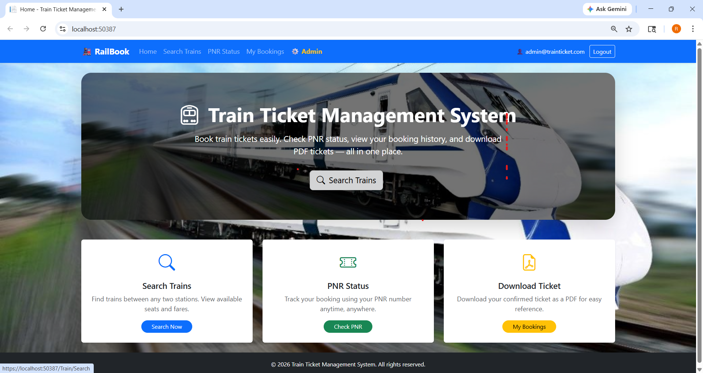
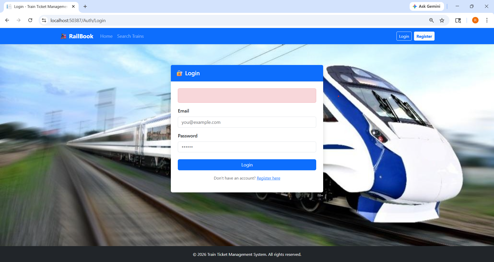
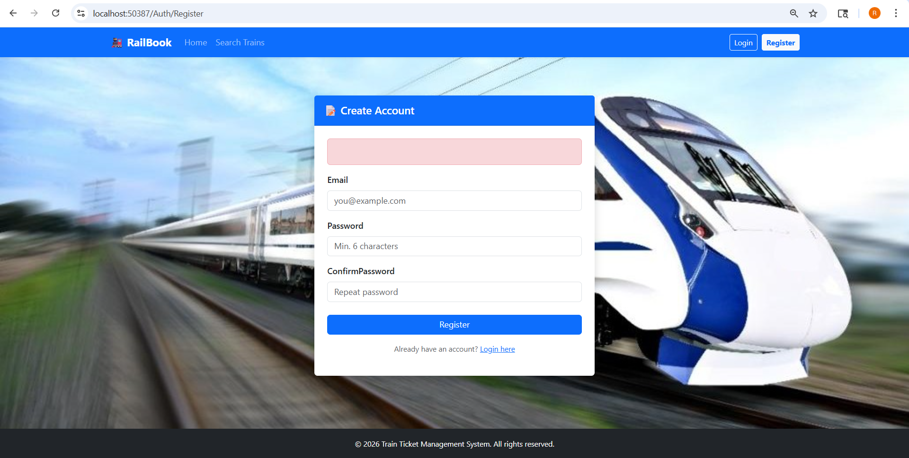
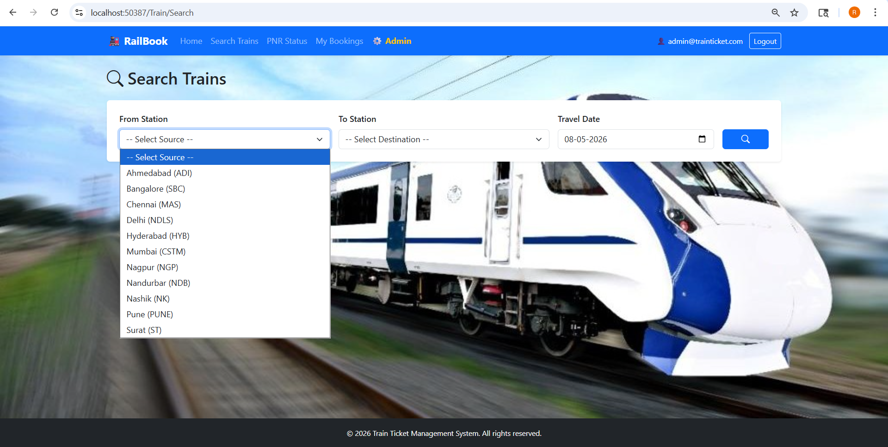
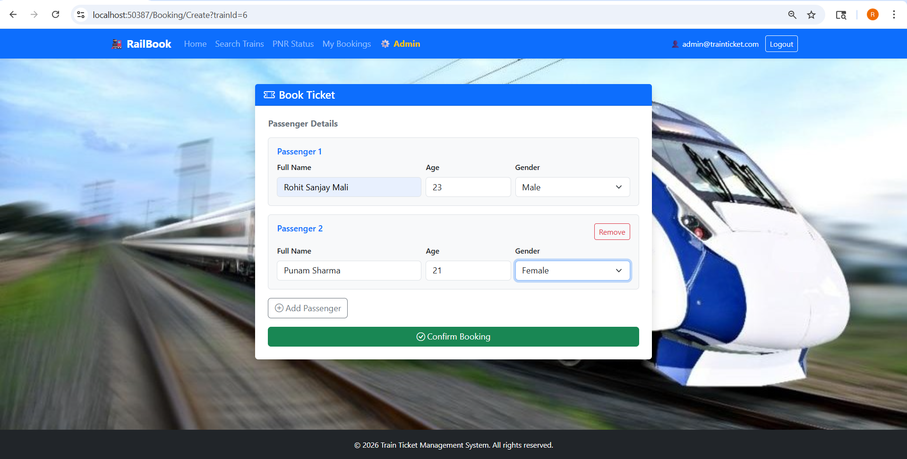
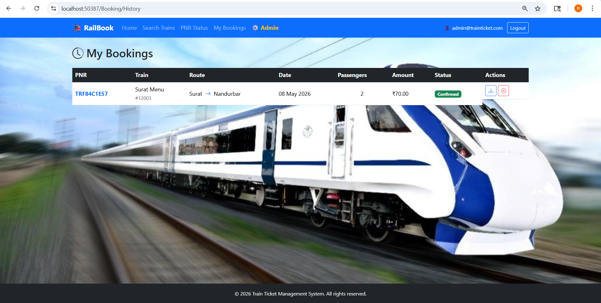
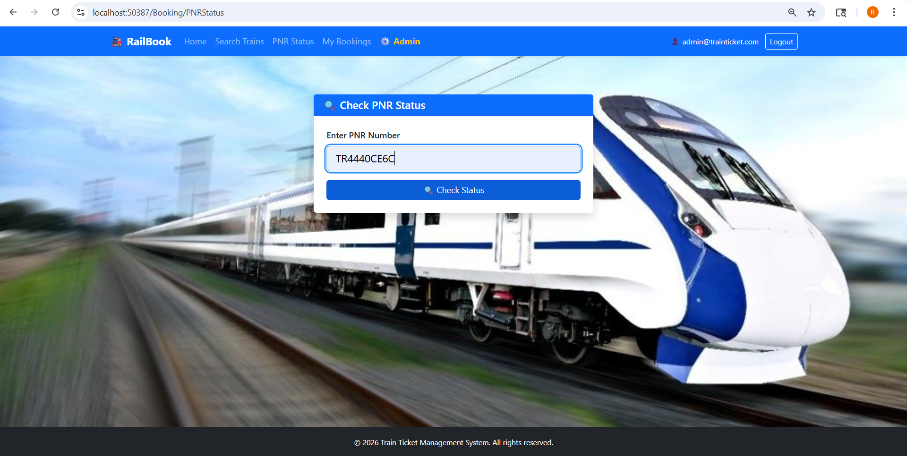
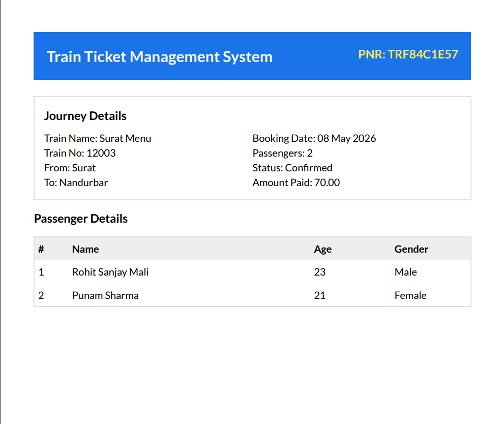
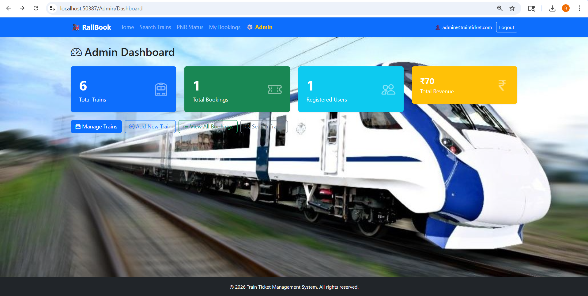
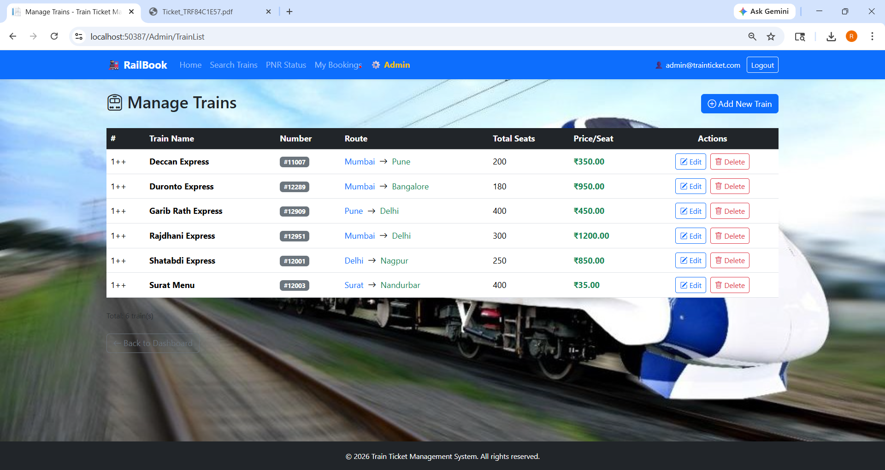

# 🚂 Train Ticket Management System

A full-featured Train Ticket Booking web application built with **ASP.NET Core 9 MVC**.

## ✨ Features

| Feature | Description |
|---------|-------------|
| 🔍 Train Search | Search trains by source & destination |
| 🎫 Ticket Booking | Book for multiple passengers with Gender |
| 📄 PDF Ticket | Download ticket as PDF (QuestPDF) |
| 🔍 PNR Status | Track booking using PNR number |
| 📜 Booking History | View & cancel your own bookings |
| ❌ Cancel Booking | Cancel confirmed bookings |
| 🔐 Authentication | Register/Login with ASP.NET Core Identity (Cookie-based Auth) |
| 👮 Authorization | Role-Based Access Control — Admin & User roles |
| 👑 Admin Panel | Dashboard with stats, Add/Edit/Delete Trains, View all bookings |

## 🛠️ Tech Stack

| Layer | Technology |
|-------|------------|
| Framework | ASP.NET Core 9 MVC |
| Language | C# |
| Database | SQL Server + Entity Framework Core (Code First) |
| Authentication | ASP.NET Core Identity |
| Authorization | Role-Based Authorization (Admin / User) |
| PDF Generation | QuestPDF |
| UI | Bootstrap 5 + Bootstrap Icons |

## 🔐 Authentication & Authorization

This project uses **ASP.NET Core Identity** for authentication:

- **Cookie-based Authentication** — users stay logged in securely
- **Role-Based Authorization** — two roles: `Admin` and `User`
- **Admin Role** — can add, edit, delete trains and view all bookings
- **User Role** — can search trains, book tickets, view booking history
- **Anti-Forgery Token** — CSRF protection on all forms
- **Password Hashing** — handled automatically by ASP.NET Core Identity

## 🚀 Getting Started

### Prerequisites
- .NET 9 SDK
- SQL Server / LocalDB
- Visual Studio 2022

### Setup Steps

```bash
# 1. Clone the repo
git clone https://github.com/RohitSanjayMali/TrainTicketManagement.git
cd TrainTicketManagement

# 2. Run migrations
dotnet ef database update

# 3. Run the project
dotnet run
```

### Default Admin Credentials
- **Email:** `admin@trainticket.com`
- **Password:** `Admin@123`

## 📸 Screenshots

### 🏠 Home Page


### 🔐 Login Page


### 📝 Register Page


### 🔍 Train Search


### 🎫 Ticket Booking


### 📜 Booking History


### 🔍 PNR Status


### 📄 PDF Ticket


### 👑 Admin Dashboard


### 🚆 Manage Trains


## 👤 Author

**Rohit Sanjay Mali** — [GitHub Profile](https://github.com/RohitSanjayMali)

---
*Built as a resume project to demonstrate ASP.NET Core MVC, EF Core, ASP.NET Core Identity, Role-Based Authorization, and PDF generation.*